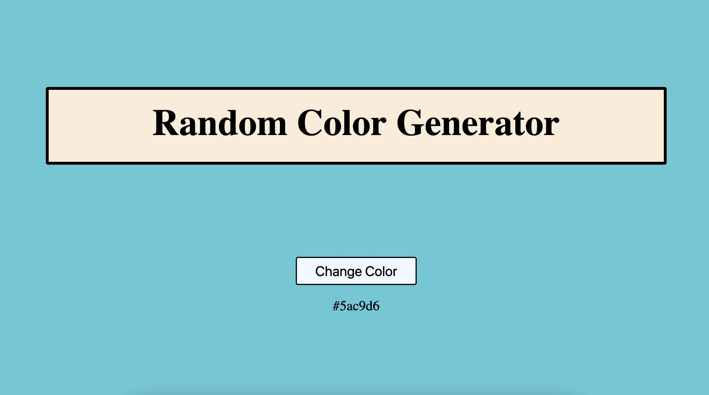

# Random Color Generator

### What does it do?
Click a button... generate a random color!

### Why?
This is a simple JS project that uses the following functionality:
1. Write a piece of code that will generate a random hexadecimal color code. We used some simple array methods, as well as the Math.random() method.
2. Identifying individual HTML elements and using an event listener on one of them.
3. Using modular programming to design the individual functions and then putting them together at the end.

### Screenshot:

